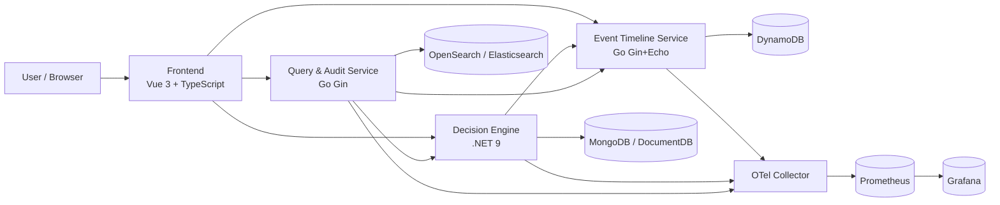

# Aevum

**A distributed, deterministic, time-aware decision platform (local-first in this repository).**

Aevum enables organizations to make decisions in real time, then deterministically replay, audit, and simulate those decisions as if they happened at any point in the past.
It combines immutable event ingestion, versioned rules, and traceable decision outputs to answer not only what happened, but why it happened.

> Most systems only answer: "What is the current state?"
> Aevum answers: "What was the state at time T? Why was that decision made? What would have happened if the rules were different?"



## Why Aevum?

| Problem | How Aevum Solves It |
|---------|-------------------|
| Decisions are opaque — no one knows *why* something happened | Every decision stores a full evaluation trace: input event, rule version, condition-by-condition results, final output |
| Systems lose history — state is overwritten | Events are immutable. Rules are versioned. Decisions are permanent. Nothing is ever deleted or mutated. |
| Replay is approximate or impossible | Deterministic evaluation guarantees: same event + same rule version + same timestamp = identical output. Every time. |
| Debugging production issues requires guesswork | Full observability: distributed tracing (OpenTelemetry), structured logging, Prometheus metrics, Grafana dashboards, audit trails |

## Architecture

```mermaid
flowchart TD
	Client[Client / Browser] --> UI[Frontend (Vue)]
	UI --> ET[Event Timeline Service]
	UI --> DE[Decision Engine]
	UI --> QA[Query & Audit Service]

	ET --> DDB[(DynamoDB)]
	DE --> MDB[(MongoDB)]
	QA --> ES[(Elasticsearch / OpenSearch)]

	DE -->|HTTP| ET
	QA -->|HTTP| ET
	QA -->|HTTP| DE

	ET --> OTel[OTel Collector]
	DE --> OTel
	QA --> OTel
	OTel --> Prom[Prometheus]
	Prom --> Graf[Grafana]
```

### Services

| Service | Language | Purpose | Database | Port |
|---------|----------|---------|----------|------|
| Event Timeline | Go 1.22 (Gin + Echo) | Event ingestion, ordering, replay streaming | DynamoDB | 8080, 9090 |
| Decision Engine | C# .NET 9 | Deterministic rule evaluation, versioned decisions | MongoDB | 8080 |
| Query & Audit | Go 1.22 (Gin) | Temporal search, correlation, diffing, audit trails | Elasticsearch | 8082 |
| Frontend | Vue 3.5 + TypeScript 5.6 | Timeline viewer, decision inspector, replay console | — | 3000 |

Note: Monitoring endpoints are exposed separately (Prometheus `9090`, Grafana `3001`).

### Tech Stack

| Layer | Technology | Version | Why |
|-------|-----------|---------|-----|
| Backend (events) | Go, Gin, Echo | 1.22 | Concurrency, throughput, goroutine-based replay |
| Backend (decisions) | C#, .NET, ASP.NET Core | 9.0 | Type safety, deterministic business logic |
| Frontend | Vue, TypeScript, Pinia, Vite | 3.5, 5.6, 2.2, 6.0 | Composition API, strict typing, reactive state |
| Event Store | DynamoDB | — | Immutable append-only model with GSIs |
| Rule Store | MongoDB (DocumentDB in AWS) | 7.0 | Flexible rule schema + version retention |
| Search | Elasticsearch (OpenSearch) | 8.15 | Temporal and full-text querying |
| Container Orchestration | Kubernetes | 1.31 | Production orchestration and scaling (optional path) |
| IaC | Pulumi (TypeScript) | — | Type-safe multi-environment infrastructure (optional path) |
| CI/CD | GitHub Actions | — | Monorepo CI and validation |
| GitOps | ArgoCD | — | Declarative deployment + self-heal |
| Packaging | Docker, Helm | — | Reproducible builds and templated deploys |
| Observability | OpenTelemetry, Prometheus, Grafana | — | Tracing, metrics, dashboards |
| Cloud | Optional (AWS-focused assets available) | — | Kept for future/optional deployment paths |

## Quick Start

### Prerequisites

- Docker + Docker Compose
- Go 1.22+
- .NET 9 SDK
- Node.js 22+

### Run Core Stack Locally

```bash
docker compose up -d --build
```

This starts the full local stack (`event-timeline`, `decision-engine`, `query-audit`, `aevum-ui`, MongoDB, DynamoDB local, Elasticsearch).

`seed-data` runs automatically during startup and is configured as a prerequisite for `query-audit` and `aevum-ui`, so test data is seeded before UI/search flows are available.

The default seeded dataset includes:
- active rules visible on the Rules page,
- seeded decisions visible on the Decisions page,
- recent `default` stream events visible on Events and Timeline pages.

| URL | Service |
|-----|---------|
| http://localhost:3000 | Aevum UI |
| http://localhost:8081 | Event Timeline API |
| http://localhost:9091 | Event Timeline Admin API |
| http://localhost:8080 | Decision Engine API |
| http://localhost:8082 | Query & Audit API |

Check that all containers are healthy/running:

```bash
docker compose ps
```

Re-run deterministic seed data manually (optional):

```bash
docker compose run --rm seed-data
```

Then refresh the UI at `http://localhost:3000`.

## Core Concepts

### Immutable Events

Events represent facts that happened in time. Once ingested, events are never updated; they are only read, replayed, and correlated. Per-stream sequence numbers enforce stable ordering.

### Deterministic Decisions

The Decision Engine evaluates versioned rules against input context and stores a complete trace of each condition/action path. Given equivalent inputs and rule version, outcomes are deterministic.

### Time Travel & Replay

Replay re-processes historical event streams from selected time windows and verifies deterministic outputs. This allows incident reconstruction and pre-production simulation for rule changes.

### Audit Trail

Each decision links to the triggering event, the rule version used, full evaluation trace, and final output. Query & Audit provides temporal search, cross-service correlation, and decision diffing.

## Documentation

- [Architecture](docs/architecture.md)
- [Event Timeline OpenAPI](api/event-timeline-openapi.yaml)
- [Decision Engine OpenAPI](api/decision-engine-openapi.yaml)
- [Query & Audit OpenAPI](api/query-audit-openapi.yaml)
- [ADRs](docs/adr)
- [Replay Model](docs/replay-model.md)
- [Data Model](docs/data-model.md)
- [Deployment Guide](docs/deployment-guide.md)
- [Local Development](docs/local-development.md)
- [Runbook](docs/runbook.md)

## Project Structure

```text
aevum-platform/
├── services/
│   ├── event-timeline/       # Go — event ingestion, storage, replay
│   ├── decision-engine/      # C# .NET 9 — rule evaluation, decisions
│   └── query-audit/          # Go — search, correlation, audit
├── frontend/
│   └── aevum-ui/             # Vue 3 + TypeScript — platform UI
├── devops/
│   ├── pulumi/               # Optional cloud infrastructure (TypeScript)
│   ├── helm/                 # Kubernetes Helm charts
│   ├── argocd/               # GitOps application manifests
│   ├── monitoring/           # Prometheus, Grafana, OTel configs
│   ├── k8s/                  # Base Kubernetes manifests
│   └── scripts/              # Local setup/seed and utility scripts
├── docs/                     # Architecture, ADRs, API specs, guides
├── .github/workflows/        # GitHub Actions CI/CD
├── .gitlab-ci.yml            # Legacy/alternate CI definition
└── docker-compose.yml        # Local development environment
```

## Architecture Decision Records

| ADR | Topic | Summary |
|-----|-------|---------|
| [ADR-001](docs/adr/001-monorepo-strategy.md) | Monorepo Strategy | Use one repository for services, frontend, and infrastructure to enable atomic changes |
| [ADR-002](docs/adr/002-language-selection.md) | Language Selection | Go for event ingestion/replay; C# for deterministic decision domain modeling |
| [ADR-003](docs/adr/003-database-selection.md) | Database Selection | Use DynamoDB, MongoDB, and Elasticsearch for distinct access patterns |
| [ADR-004](docs/adr/004-event-ordering-and-idempotency.md) | Ordering + Idempotency | Per-stream sequencing and idempotency keys prevent duplicates and preserve order |
| [ADR-005](docs/adr/005-replay-determinism.md) | Replay Determinism | Deterministic contract and hash verification for replay correctness |
| [ADR-006](docs/adr/006-authentication-strategy.md) | Authentication | JWT for public APIs, network-isolated admin plane |
| [ADR-007](docs/adr/007-observability-strategy.md) | Observability | OpenTelemetry + Prometheus + Grafana with correlated structured logs |
| [ADR-008](docs/adr/008-infrastructure-as-code-choice.md) | IaC Choice | Pulumi TypeScript for type-safe, programmable infrastructure |

## What I Would Do Differently / If I Had More Time

- Introduce gRPC for internal service-to-service contracts and stronger interface evolution.
- Add an event schema registry with compatibility enforcement and payload version migration tooling.
- Implement Playwright end-to-end tests for critical frontend and replay workflows.
- Formalize CQRS boundaries with dedicated read models for heavy audit/search workloads.
- Add chaos experiments (pod kill, packet loss, dependency latency) to validate resilience claims.

## License

MIT

